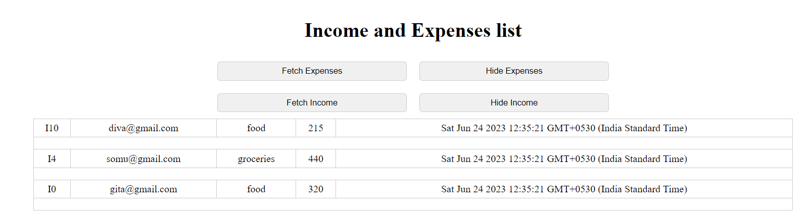
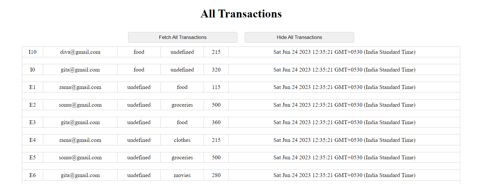
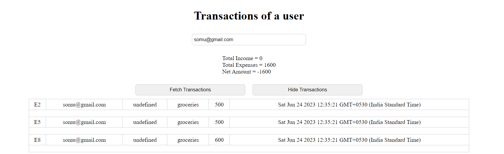

# Copilot-hackathon
1.Users enter income submission form or Expense submission form
    --for income submission, it will take email,source,amount as inputs.
    
    --for expense submission, it will take email,paidfor,amount as inputs.
    
    based on the type of submission it will generate unique id for each transaction and every transaction gets stored with timestamp.
    
2.Income and Expenses List
    --All the income and expenses transactions list will be listed in this component

3.Deleting the particular record based on UID.
    --Users take uid from their list of transactions and deletes the record by giving UID.

4.All Transactions
    --This component will show all the transactions irrespective of the user.

5.Transactions of particular user
    --Users give their email as an input in order to get their income and expenses list of transactions.
    --this component will show their net loss or net profit that they made.

